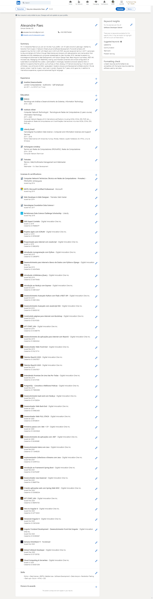

# Alexandre-Paes-Resume

Alexandre Paes

Campo Grande, Mato Grosso do Sul, Brazil
alexpaes.itsolutions@gmail.com +5521993754048 somente whatsapp \

linkedin.com/in/alexandre-paes

## Summary

Hi! I'm Alexandre Paes but you can call me Alex if you prefer. I am 38 years old and in 2017 I started my
transition from 8 years in Network Infrastructure to Software Development. Some brief contacts with programming,
the first in 2001 with Delphi and in 2013 with PHP, Java and Javascript Vanilla. In 2017 I came back to stay and
started with Python through Data Science and Analysis with data extraction and manipulation from datalakes
and SQL database and using excel spreadsheets to clean the data. 2018 I decided to expand my knowledge
and advanced to Web Development, with Python Django Flask, React Angular Vue Node.js, REST API,
Microservices, Messaging with RabbitMQ, making use of Dockers containers and simple configuration of
kubernetes to orchestrate the clusters. I participated in challenges, hackatons and even selective items in
addition to opportunities for python, such as Ruby on Rails, Golang, C # .Net and Java Spring. In October of the
last year, 2020, I graduated in Systems Analysis and Development at Estácio de Sá University, in Rio
de Janeiro, where I lived for 4 years. I also lived in London, England, for 7 years, which gave me, in addition to
international experience, a good and advanced English language skills.

## Experience

Analista Desenvolvedor
London Computadores - Autônomo - Self-employed
Jan 2009 - Jul 2018

### -> Projects as an Independent Contractor/Self-Employed/Freelancer

- 2018:
  // --> Job: Pizza Delivery Website (Adapted and Reused its structure for his wife's Pet Shop too for half of the price. Great deal.)
  // --> Role: Full Stack Developer
  // --> Stack: Python Django, Postgres, Bootstrap, Jquery, SQLAlchemy
  
- 2018:
  // --> Job: Public Tender for Governments Careers Crawler's and API's
  // --> Role: Back-End Developer
  // --> Stack: Python Flask, Postgres, BeautifulSoup4, Requests, SQLAlchemy
  
- 2019:
  // --> Job: Desktop Library Management System
  // --> Role: Back-End Developer
  // --> Stack: Python PyQt, SQLite, Microsoft Excel
  
- 2019:
  // --> Job: Desktop-Web-Browser Employee Management System With Integrated Asynchronous Chat App
  // --> Role: Full Stack Developer
  // --> Stack: // v1= Python PyQt, SQLite, Socket
                // v2= Tornado, Postgres, Websockets 
                // v3= Node.js Express.js, MongoDB, Socket.io
          
- 2020:
  // --> Job: Sport Ware Online Store
  // --> Role: Full Stack Developer
  // --> Django, Django-Restframework, React.js, React Native
  
- 2020 / 2021:
  // --> Job: Sports Sponsorship ROI Data Analytics
  // --> Role: Full Stack Developer
  // --> Stack: Django, Django-Restframework, React.js, GraphQL, Graphene, FastAPI, Flask, SQLAlchemy, MongoDB, AWS, Terraform

- 2021:
  // --> Job: CMMC Cyber Security Trainning Platform By Xogito Group Inc.
  // --> Role: Backend Python Developer
  // --> Stack: Python, Flask, PostgreSQL, SQLAlchemy, Alembic, Gitlab

## Education

- University Estácio de Sá
Tecnólogo em Análise e Desenvolvimento de Sistemas, Information Technology - System Analysis and Development - Graduated
2018 - 2020

- Instituto Infnet
Computer Network Technologist - Tecnologia em Redes de Computadores (3 years
course), Information Technology
2017 - 2020
Computer Network Degree with 8 international certifications including MCSA, CCNA, CEH, PMP, etc...
Graduação em Redes de Computadores com 8 certificações internacionais incluindo MCSA, CCNA,CEH, PMP, etc...

- Udacity Brasil
Nanodegree Foundation Data Science I, Computer and Information Sciences and
Support Services
2017 - 2018
Python Data Science with Anaconda, Numpy, Pandas, Matplot, Jupyter Notebook, Git, HTML, Linux & Windows

- Anhanguera Uniderp
Tecnico em Redes de Computadores (PRONATEC), Redes de Computadores
2014 - 2016
Computer Network Technician

- Treinatec
Técnico, Web/Multimedia Management and Webmaster
2013 - 2013
Webmaster - Full Stack Development

## Licenses & Certifications

- Computer Network Technician (Técnico em Redes de Computadores - Pronatec)
-> PRONATEC Anhanguera
- MCPS: Microsoft Certified Professional -> Microsoft
- Web Developer & Web Designer -> Treinatec Web Master
- Nanodegree Foundation Data Science I
Bertelsmann Data Science Challenge Scholarship - Udacity
- SMS Expert Comtele - Digital Innovation One Inc.
F86E6D7F
- Projetos ágeis com SCRUM - Digital Innovation One Inc.
9FDE3DBF
- Programação para internet com JavaScript - Digital Innovation One Inc.
EBE26FE2
- Introdução à programação com Python - Digital Innovation One Inc.
2965BFFC
- Desenvolvimento para Internet e Banco de Dados com Python e Django - Digital
Innovation One Inc. AD479456

- Introdução à biblioteca jQuery - Digital Innovation One Inc.
6A779AE6
- Introdução ao Node.js com Express - Digital Innovation One Inc.
06B1DA47
- Desenvolvimento Avançado Python com Flask e REST API - Digital Innovation
One Inc.
0681C85A
- Desenvolvimento Avançado com JavaScript ES6 - Digital Innovation One Inc.
E85D51EC
- Construindo páginas para internet com Bootstrap - Digital Innovation One Inc.
EC4703E5
- GFT START_UNI - Digital Innovation One Inc.
61D9877B
- Desenvolvimento de aplicações para internet com ReactJS - Digital Innovation
One Inc. 2B4020A2
- Desenvolvedor Web Front-End - Digital Innovation One Inc. F4215716
- Talentos ReactJS 2020 - Digital Innovation One Inc. 33ACFECF
- Entendendo Promises De Uma Vez Por Todas - Digital Innovation One Inc.
4414730E
- PostgreSQL - Conceitos e Melhores Práticas - Digital Innovation One Inc.
73B5DDB3
- Desenvolvimento back-end com Node.js - Digital Innovation One Inc.

- Desenvolvedor Web Back-End - Digital Innovation One Inc.
04E8CAED
- Desenvolvedor Web FULL STACK - Digital Innovation One Inc.
EF309819
- Primeiros passos com .Net + C# - Digital Innovation One Inc.
C45CD626
- Desenvolvimento de aplicações com .NET - Digital Innovation One Inc.
8C49368E
- Desenvolvimento básico em Java - Digital Innovation One Inc.
1244B20D
- Implementando Collections e Streams com Java - Digital Innovation One Inc.
3AFE7CC2
- Introdução ao Framework Spring Boot - Digital Innovation One Inc.
6A7545BF
- Desenvolvedor Java Essencial - Digital Innovation One Inc.
B88FF79A
- Criando aplicações web com Spring Web MVC - Digital Innovation One Inc.
D059ED3A
- GFT START_UNI - Digital Innovation One Inc.
B66FA75D
- Intro to Angular 8 - Digital Innovation One Inc.
AF7165CE
Advanced Angular 8 - Digital Innovation One Inc.
C9C52383
- Angular Frontend Development - Desenvolvimento Front-End Angular - Digital
Innovation One Inc.
5C0ED64F
- Semana OmniStack 11 - Rocketseat
Global Fullstack Developer - Digital Innovation One Inc.
071D57E2
- Cloud Computing & Serverless - Digital Innovation One Inc.
650D1D54

## Skills

Python   •   Data Science   •   RESTful WebServices   •   Software Development   •   Data Analysis   •  
Penetration Testing   •   Start-ups   •   Scrum   •   HTML   •   CSS 

